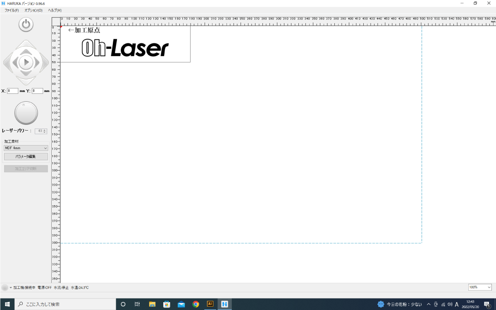
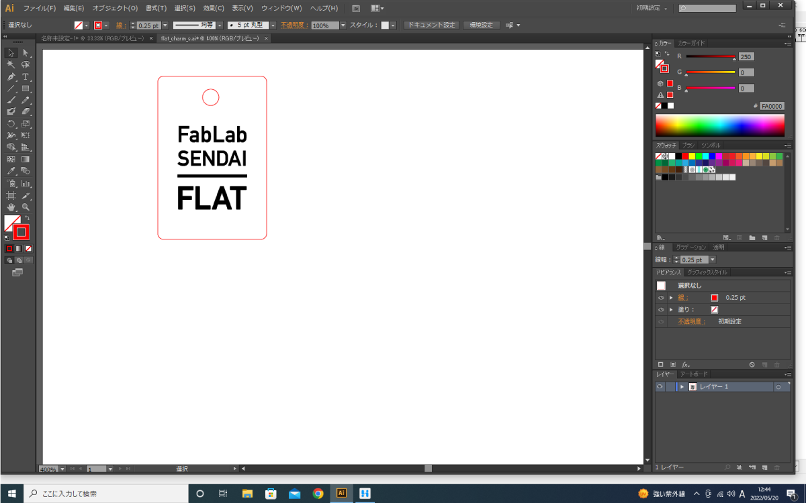
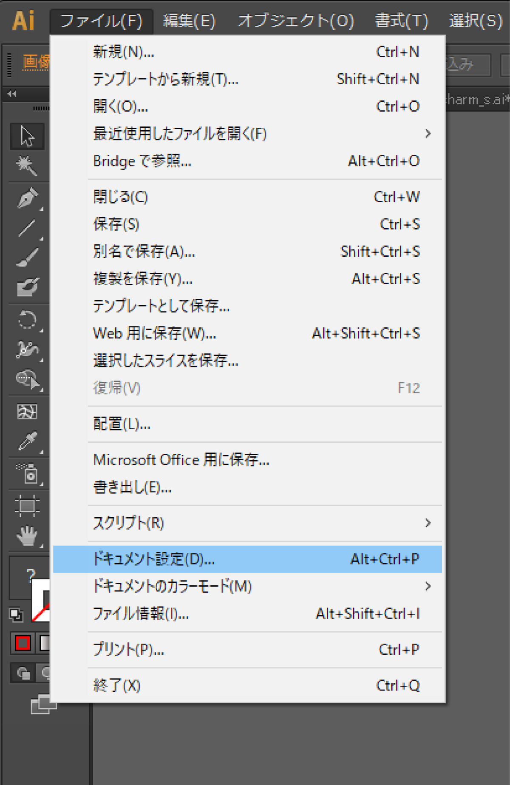
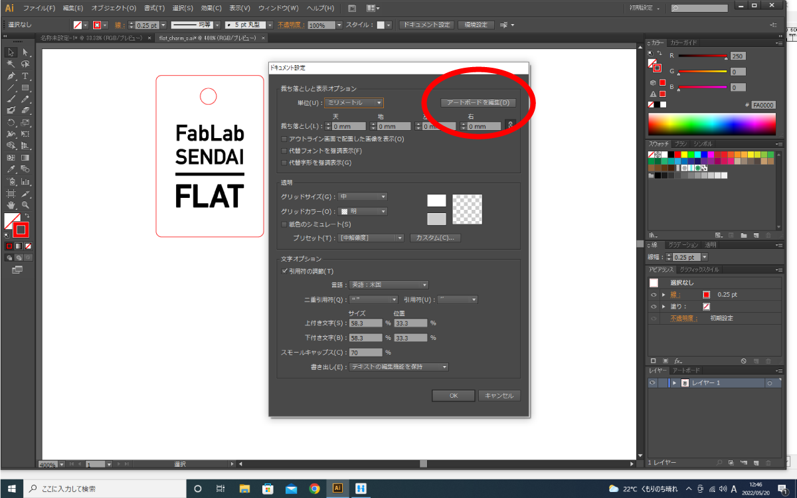
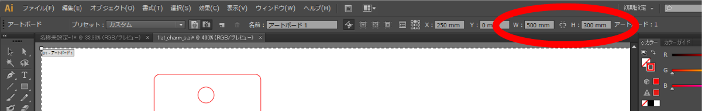
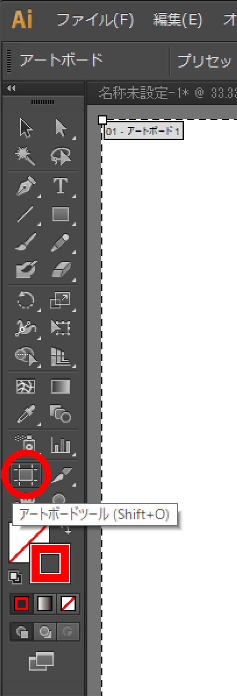
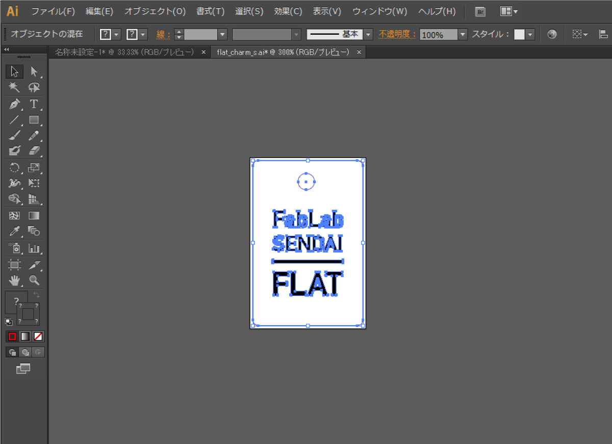
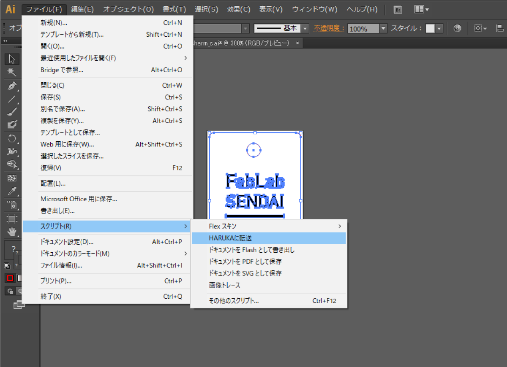
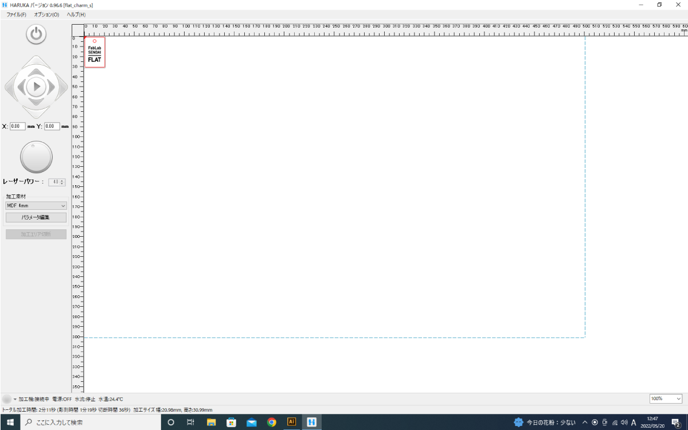

# 02.レーザーカッター用ソフト起動〜Adobe Illustratorからのデータ送信
  

## 02.1 データ設定
 

 

デスクトップにある**HARUKA**のアイコンをダブルクリックし、ソフトを立ち上げます。 
※Adobe Illustratorからデータを送る前に、必ずHARUKAを起動させておくこと！ 
また、ソフトの起動中にHARUKAから許可を求められたら**「はい」**をクリックします。 
 

 

上のようなソフトウェアが起動します。 
 
 
 

## 02.2 レーザーカッター用ソフトウェア「HARUKA」を起動
 

 

各種ソフトウェアで作成したデータをAdobeIllustratorで開き、以下のとおりに設定します。 
* **加工データサイズ：** 最大500mm x 300mm
* **アートボードサイズ：** 加工データに合わせて設定
* **カラーモード：** RGB
* **カット線：** カラー R 255 G 0 B 0 ／ 太さ 0.25pt
* **彫刻：** カラー R 0 G 0 B 0
 
 
 
 

## 02.3 アートボード設定
 
HARUKAはアートボードごとデータを読み込むため、 
アートボードの大きさを加工データの大きさに合わせておく必要があります。 
 

**（方法1）ファイルから設定** 

 

**“ファイル”** ＞ **“ドュメント設定”** を選択します。 
 

 

**ドキュメント設定** パネル右上の **アートボードを編集**をクリックします。 
 

 

ウィンドウ上部に数値入力欄が表示されます。 
**W**にアートボードの横幅、**H**にアートボードの縦幅を入力します。 
入力が完了したら、ウィンドウ左端の黒い矢印アイコンをクリックします。 
 
 
 

**（方法2）アートボードアイコンから設定** 

 

ツールボックス下部の**“アートボードツール”**アイコンをクリックします。 
 

 

ウィンドウ上部に数値入力欄が表示されます。 
**W**にアートボードの横幅、**H**にアートボードの縦幅を入力します。 
入力が完了したら、ウィンドウ左端の黒い矢印アイコンをクリックします。 
 
 
 

## 02.4 データの送信
 

 

Adobe Illustratorで、加工したいデータを全て選択します。 
 

 

**“ファイル”** ＞ **“スクリプト”** ＞ **“HARUKAに転送”** を選択します。 
 

 

データ転送のアニメーションが転送された後に、HARUKAに加工データが表示されます。
