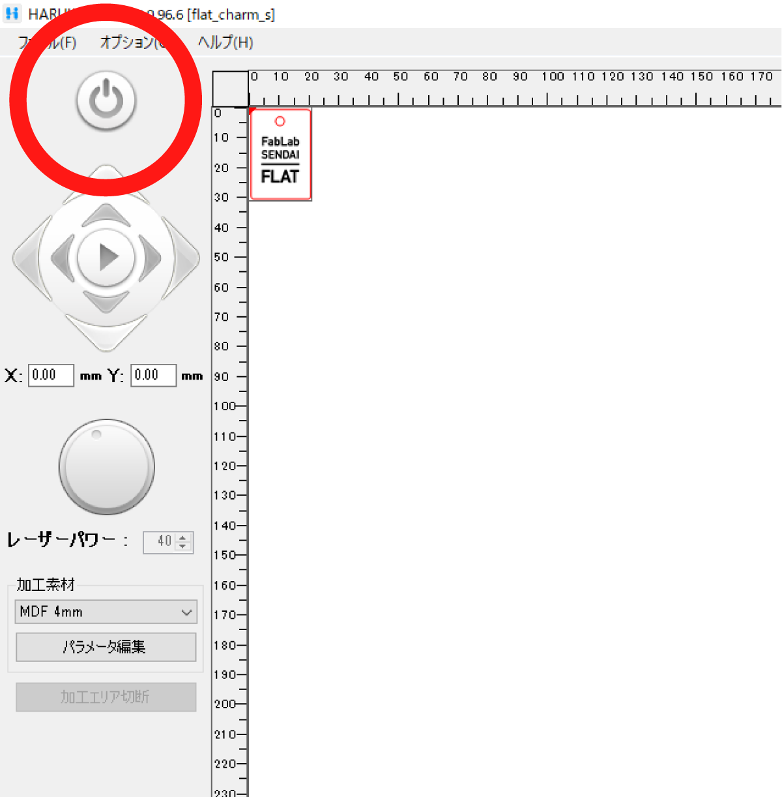
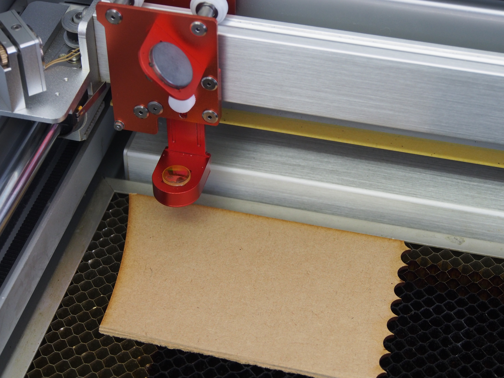
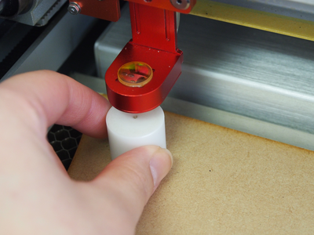
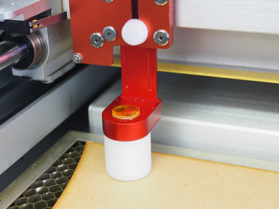

# 03.マシンのセットアップ
  

## 03.1 マシンの起動
 

 

HARUKAの**右上に表示されている電源ボタン**を長押しし、レーザーカッターの電源を入れる。 
 

### ★起動前の確認事項

* マシン上部の蓋は閉まっているか。
* 電源を入れる前に、ベッド（加工テーブル）の上には何も載っていないか。
* X軸アームは自由に動く状態か。（X軸レールの上にゴミ等がはさまっていないか）
* 加工テーブルの下には何も入っていないか。（ハニカムテーブルが傾いていないか）
 
 
 

## 03.2 素材の設置
 

 

素材をベッド（加工テーブル）の上に置きます。 
材料が薄い・軽い・反り返りのある場合は文鎮やマスキングテープなどで端を押さえて平らにします。 
 
 
 

## 03.3 レーザー焦点距離の調整
 

レーザーカッターは、レーザー光の熱で様々な素材を加工します。 
虫眼鏡で太陽光を集め、その熱によって紙を燃やすことができるという現象と近いしくみです。 
（参照：[http://rikasapo.yagami-inc.co.jp/elementary/3nen/3-04.php?tab=3](http://rikasapo.yagami-inc.co.jp/elementary/3nen/3-04.php?tab=3)） 
そのため、綺麗に加工をするためには、レンズと素材との距離をきちんと設定する必要があります。 
 

  

レーザーカッター本体の右上に用意されている白い円柱形のブロックを、 
レンズと材料の間に置いてして焦点距離の調整を行います。 
レーザー光の出るヘッドの白いネジを左に回して緩め、レンズの付いた可動部をブロックに軽く押し付けます。 
この時に**レンズには決して手を触れず**、可動部を左右から挟むようにして持ち、上下に動かして下さい。 
焦点距離の調整が完了したら、ブロックを定位置に戻します。 
 

### ★注意事項
* レンズやミラーは非常に傷がつきやすいため、決して直接手を触れないこと。 
指輪等をつけたままや、ペンやピンセットを持ったままレンズ周りの操作を行なうことは禁止です。 
レンズに傷がつかないよう十分配慮してください。 
（レンズやミラーを破損した場合は、1つあたり3万円程度の修理費がかかります。）
* 加工時にベッド（加工テーブル）のヤニが付着する恐れがある為、 
綺麗に仕上げたい場合には、アクリル板等のは保護紙を剥がさずに加工してください。
* ハニカムテーブルは薄い金属でできており、上から力をかけると歪む可能性があるため優しく扱うこと。
