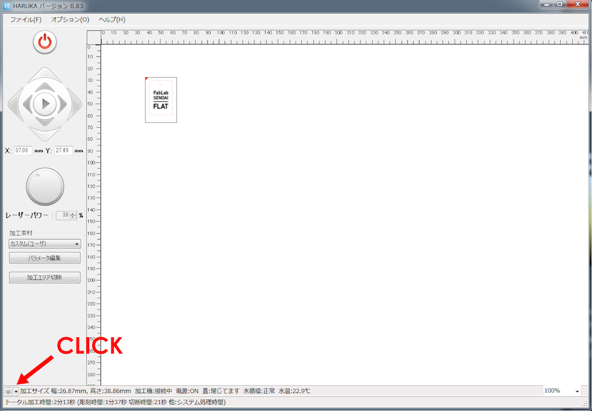
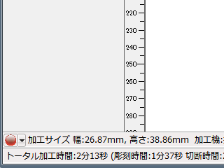
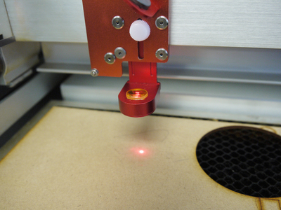
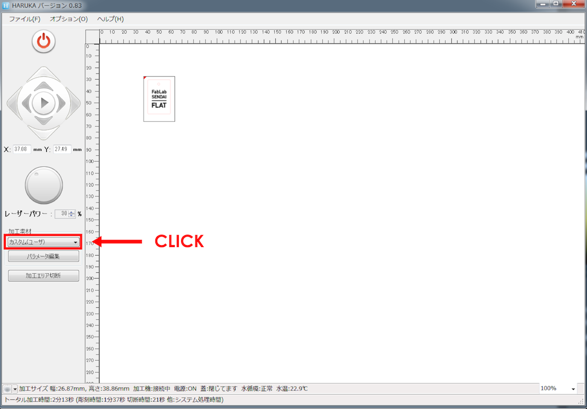
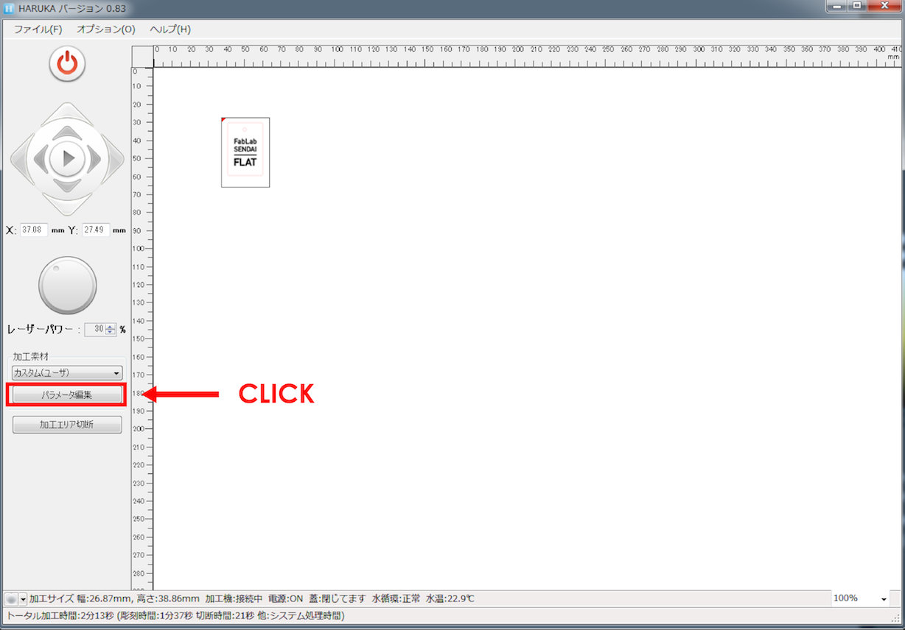
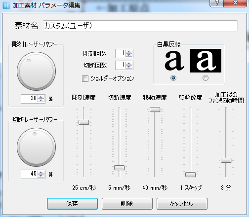
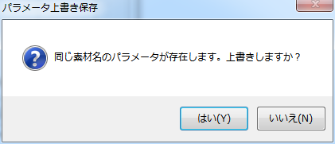
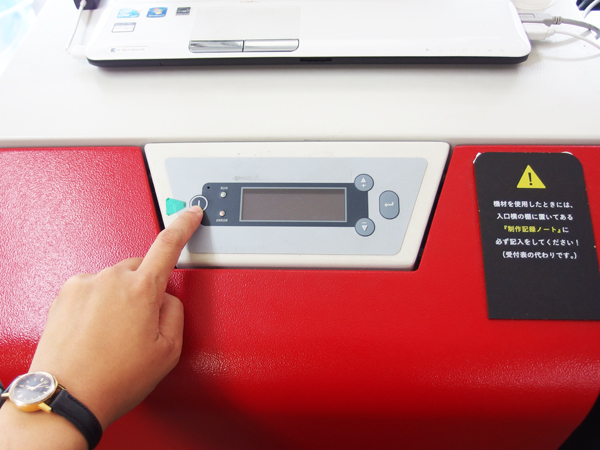
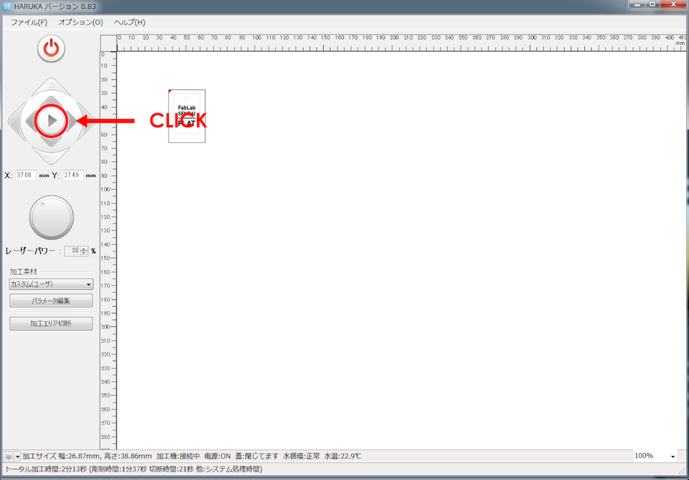
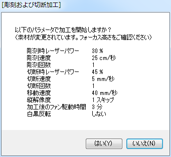

# 04.ソフトウェアのセットアップ〜加工
  

## 04.1 素材とデータの位置調整
 

 

HARUKAの左下に表示されている**グレーの丸ボタン**をクリックします。 
 
 

  

そうすると、表示がグレーから赤に変わり、HAJIMEのレーザーポインタが照射されます。 
このときに、レーザーポインタの光がぼやけている（はっきりしていない）場合は、 
焦点距離がズレているか、レンズやミラーが汚れている可能性があります。 

問題がなければ、データを加工したい位置にドラッグ&ドロップで移動させます。 
このとき、**データ左上の赤い三角形がレーザーポインタの照射位置**となります。 
 
 
 

## 04.2 レーザーのパワーや加工速度の設定
 

ウィンドウ左側の**“加工素材”**メニューから、レーザー加工したい素材を選択します。 
もし加工したい素材名が無い場合には、以下の手順で設定を行います。 
  

 

加工素材名を**“カスタム（ユーザ）”**に設定します。 
  

 

**“パラメータ編集”**をクリックします。  
 

 

上記のようなウィンドウが表示されるので、パラメータを変更し、**“保存”**をクリックします。 
※詳しくは左記メニューの06.注意・備考ページを参照。  
 

 

再確認ウィンドウが表示されたら、**“はい”**を選択します。  

※パラメータを変更した場合は、小さい四角形などをテスト加工し、 
求めている加工ができることを確認してから本番に望んでください。 
 
 
 

## 04.3 加工開始
 

 

レーザー加工開始位置とパラメータの設定が完了したら、マシンの蓋を閉め、集塵機の電源を入れます。 
  

 

HARUKAの加工開始ボタン（再生ボタン）をクリックします。 
  

 

パラメータの再確認ウィンドウが表示され、内容に問題がなければ**“はい”**をクリックします。 
そうすると加工が開始し、完了すると自動停止します。 
集塵機は全ての加工が完了してから、電源を入れたときと同じボタンを長押ししてスイッチオフします。 
  
