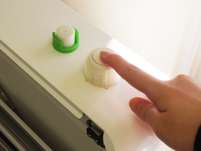
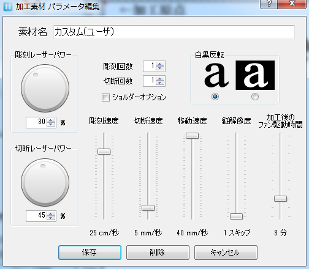

# 07.注意・備考
  

## ★レーザー加工について
 

レーザー加工は、レーザー光の熱で様々な素材を加工します。 
虫眼鏡で太陽光を集め、その熱によって紙を燃やせるという現象に近いしくみです。 
そのため、綺麗に加工をするためには、レンズと素材との距離をきちんと設定する必要があります。 
加えて、素材によっては切断面や彫刻面が焦げたような仕上がりになる点を考慮しなければいけません。 

また、レーザーはパワーや加工速度を一度設定すると、加工が完了するまで 
設定内容を変更できないため、表面がなるべく平らで密度が一定な素材の加工に適しています。 
 
 
 

## ★データの作成について
 

* ドキュメントのカラーモードがRGBになっているか必ず確認すること。
* パスの数が多いと、IllustratorからHARUKAにデータを送るのに時間がかかるため、 
パスの数が多い場合は複数に分けて加工するのがおすすめです。 
 

**【 機材利用時の注意 】**

* **​機材稼動時は、絶対に機材のそばにいること。** 
レーザーカッターは稼動時に火が出る可能性があり、それにより火災が発生したという事例もあります。
  * [http://fab.cba.mit.edu/content/tools/universal\_laser/](http://fab.cba.mit.edu/content/tools/universal_laser/)  
  * [http://blog.goo.ne.jp/rucco075/e/0060fe18904a2f608f83c2b14f0c312a](http://blog.goo.ne.jp/rucco075/e/0060fe18904a2f608f83c2b14f0c312a)
 
 

* **“塩化◯◯”という素材は加工厳禁。** 
人体に有毒なガスが発生するのに加えて、マシン内部を腐食してしまい稼働できなくなります。

  * [http://comnet-blog.jugem.jp/?eid=273](http://comnet-blog.jugem.jp/?eid=273)  
  * [http://www.laserworks.jp/blog/maintenance/post-162.html](http://www.laserworks.jp/blog/maintenance/post-162.html)
 
 

* **湾曲した板の加工は要注意。** 
  曲がってしまった板も、捨て板に両面テープやマスキング・テープで固定することで 
  水平に固定することができますが、レーザーカットされたパーツが反り返り 
  思わぬアクシデントを起こすことがあります。 
  （熱で変形しやすい素材についても同様のアクシデントが発生する可能性が大いにあります。） 
  ※FLATで実際に起こった事故とその解決策をまとめた記事はこちら↓ 
  [あやうし！トロテックレーザーで気をつけたいこと。](https://fablabsendai-flat.com/trotec-tips01/)
 
 
 

## ★加工中の注意点・エラーついて
 

* **HARUKAが起動しない** 
HARUKAを再起動させるか、パソコン自体を再起動してデータを送信し直してください。 

* **切断部分が異様に焦げ付いている** 
レンズと素材との焦点距離がずれている可能性があります。再度調整をしてください。 

* **切断加工中、材料の端が反り上がってきた** 
焦点距離が合わなくなり、発火する恐れがあります。 
加工前に文鎮などで重石をしておくか、加工中であれば電源ボタンを一度押して作業を停止してください。 

* **火が出た、挙動がおかしい** 

 

レーザーカッター本体の電源ボタンを一度押して、加工を停止してください。 
 
 
 

## ★加工オプションについて
 

 
 

加工オプションの各項目の詳細は下記のとおりです。  

* **彫刻レーザーパワー：**彫刻加工のレーザーの強さ。
* **切断レーザーパワー：**切断加工のレーザーの強さ。 
(パワーは、数値が大きくなればなるほど深く彫ることができます。)
* **彫刻回数：**彫刻を行う回数。通常は1回でOKです。
* **切断回数：**切断を行う回数。通常は1回ですが、2回以上にするとその回数だけ同じ箇所を加工します。
* **白黒反転：**彫刻を行う部分を反転します。
* **彫刻速度：**彫刻加工のスピード。
* **切断速度：**切断加工のスピード。 
(速度は、数値が小さくなればなるほどゆっくり動くので深く彫ることができます。)
* **移動速度：**レーザーを出していない時のヘッドの移動スピード。
* **縦解像度：**彫刻加工の解像度。(上げるほど、加工は早く終わるが、彫刻は荒くなります。)
